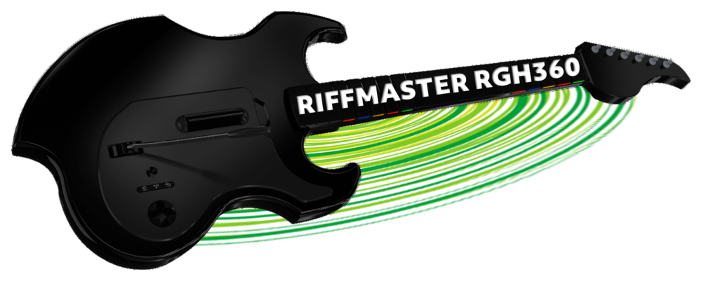

  

<h1 align="center">riffmaster-rgh360 (patched)</h1>

  Use a PDP RiffMaster wireless guitar on an RGH/JTAG Xbox 360 — in Guitar Hero, Rock Band,
  and the dashboard — with a single DashLaunch plugin.

  <a href="https://github.com/Easy301/riffmaster-rgh360-fixed/releases/latest"><b>Download Release</b></a>
  &nbsp;·&nbsp;
  <a href="docs/INSTALL-FIXED.md"><b>Installation Guide</b></a>
  &nbsp;·&nbsp;
  <a href="CREDITS.md"><b>Credits</b></a>

  
    Patched community release based on
    <a href="https://github.com/Durg5/riffmaster-rgh360">Durg5/riffmaster-rgh360</a>
    · GPL-3.0
  

---

## About this release

This project builds on **[Durg5's riffmaster-rgh360](https://github.com/Durg5/riffmaster-rgh360)**,
which made the RiffMaster work on Xbox 360 in the first place. **Durg5 and
[EinTim23](https://github.com/EinTim23/hiddriver360) deserve the vast majority of credit**
for that work — see [CREDITS.md](CREDITS.md).

Two gaps in the original patch:

| | Original release | This release |
|---|---|---|
| **RiffMaster** | Guitar failed to work when connected to the 360 | Should work on any console that meets the [original requirements](#requirements) |
| **Other guitars (UsbdSecPatch)** | UsbdSecPatch guitars were unusable while riffmaster was loaded | Riffmaster and UsbdSecPatch guitars can run together (v1.0.4: HID pass-through) |

> **Use the patched `riffmaster.xex` from [Releases](https://github.com/Easy301/riffmaster-rgh360-fixed/releases/latest)** (~94 KB).
> The original unpatched file from Durg5's repo is ~324 KB. **You still need this build
> even if you only use the RiffMaster itself.**

More detail: [FORK-NOTICE.md](FORK-NOTICE.md) · [CHANGELOG.md](CHANGELOG.md)

---

## Quick start

1. Download **`riffmaster.xex`** from **[Releases](https://github.com/Easy301/riffmaster-rgh360-fixed/releases/latest)**
2. Copy it to your Xbox HDD as `Hdd:\riffmaster.xex`
3. Open **DashLaunch → Plugins**, select the file in a free slot, and **save `launch.ini`**  
   *(or add `pluginN = Hdd:\riffmaster.xex` to `launch.ini` by hand)*
4. **Hard reboot** the console (full power off)
5. Plug in the RiffMaster dongle, turn the guitar on, wait a few seconds

Full walkthrough and troubleshooting: **[docs/INSTALL-FIXED.md](docs/INSTALL-FIXED.md)**

---

## Requirements

| | |
|---|---|
| Console | RGH or JTAG Xbox 360 with DashLaunch |
| Kernel | **17559** (retail) or **17489** (devkit) |
| Hardware | PDP RiffMaster guitar and its **2.4 GHz USB dongle** (VID `0E6F`, PID `0248`) |
| Boot | Disc tray **closed** at power-on |

The guitar's USB-C port is for firmware/bootloader only — gameplay requires the dongle.

**Using UsbdSecPatch for a second guitar?** This release also fixes running other
third-party guitars (e.g. CRKD-type) alongside the RiffMaster. If you only use a
RiffMaster, you still want this patched build — see the table above.

---

## What works

- Frets, strum, whammy, tilt, Start/Back, guide button, and solo frets
- Dashboard and Aurora navigation
- Disconnect/reconnect mid-session without rebooting
- **RiffMaster + UsbdSecPatch on the same console** — verified on hardware with a CRKD
  guitar and RiffMaster together in DashLaunch

See [docs/KNOWN_ISSUES.md](docs/KNOWN_ISSUES.md) for limitations (beta software, small
test sample, no rumble, etc.).

---

## Game compatibility

Tested on hardware by Durg5 (**21 titles**; 20 work out of the box). Guitar Hero III needs
subtype `0x07` instead of the default — the plugin switches automatically.

| Game | Title ID | Subtype | Result |
|---|---|---|---|
| Guitar Hero 1 | `0x41560883` | `0x06` | ✅ |
| Guitar Hero II | `0x415607E7` | `0x06` | ✅ |
| **Guitar Hero III: Legends of Rock** | `0x415607F7` | **`0x07`** | ✅ auto override |
| Guitar Hero: Aerosmith | `0x41560819` | `0x06` | ✅ |
| Guitar Hero: World Tour | `0x4156081A` | `0x06` | ✅ |
| Guitar Hero: Metallica | `0x41560830` | `0x06` | ✅ |
| Guitar Hero: Van Halen | `0x4156083D` | `0x06` | ✅ |
| Guitar Hero: Smash Hits | `0x4156083E` | `0x06` | ✅ |
| Guitar Hero 5 | `0x41560840` | `0x06` | ✅ |
| Band Hero | `0x4156085C` | `0x06` | ✅ |
| Rock Band 1 | `0x45410829` | `0x06` | ✅ |
| Rock Band 2 | `0x45410869` | `0x06` | ✅ |
| Rock Band 3 | `0x45410914` | `0x06` | ✅ |
| Rock Band: AC/DC Live | `0x45410889` | `0x06` | ✅ |
| The Beatles: Rock Band | `0x454108B1` | `0x06` | ✅ |
| Lego Rock Band | `0x575207F0` | `0x06` | ✅ |
| RB Track Pack Vol. 2 | `0x45410881` | `0x06` | ✅ |
| RB Track Pack: Classic Rock | `0x454108B0` | `0x06` | ✅ |
| RB Country Track Pack | `0x454108CA` | `0x06` | ✅ |
| RB Country Track Pack 2 | `0x4541092C` | `0x06` | ✅ |
| RB Metal Track Pack | `0x454108CD` | `0x06` | ✅ |
| Green Day: Rock Band | — | — | ⚠️ crashes on startup |

> **NTSC discs only** in this table. PAL or reissue copies may use different title IDs.
> If a game fails, check the `RIFFMASTER: title id` line in your log.

---

## Documentation

| Guide | Audience |
|---|---|
| [INSTALL-FIXED.md](docs/INSTALL-FIXED.md) | **End users** — step-by-step install |
| [INSTALL.md](docs/INSTALL.md) | Extended install and debug (from original project) |
| [HOW_IT_WORKS.md](docs/HOW_IT_WORKS.md) | Technical overview of the GIP driver |
| [PROTOCOL.md](docs/PROTOCOL.md) | Protocol reference |
| [BUILDING.md](docs/BUILDING.md) | Build from source (requires Xbox 360 XDK) |
| [CHANGELOG.md](CHANGELOG.md) | What changed in this release |

---

## Credits

**Durg5** ([riffmaster-rgh360](https://github.com/Durg5/riffmaster-rgh360)) built the
RiffMaster driver. **EinTim23** ([hiddriver360](https://github.com/EinTim23/hiddriver360))
built the foundation it runs on. This release adds three small patches on top for
real-world hardware that did not work with the original build alone.

Full attribution chain: **[CREDITS.md](CREDITS.md)** · **[NOTICE.md](NOTICE.md)**

---

## Licence

GPL-3.0, inherited from hiddriver360. See [LICENSE](LICENSE).
